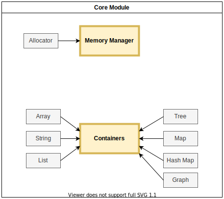

# Windmill Engine

The goal of this project is to build a cross-platform, multithreaded game engine that can easily create both 2D and 3D games using modern graphics APIs such as DirectX, Vulkan and Metal. The engine should be capable of deploying games for desktops, consoles and mobile platforms in a scalable way, so the same game project should be buildable for all platforms without changing the game's code.

## Getting started

### Step 1 - Clone the repository

```bash
git clone --recurse-submodules https://github.com/brianbatista93/windmill-engine-private.git
```

### Step 2 - Install the dependencies

| Dependency | Version |
|:---|---:|
| [CMake](https://cmake.org/) | 3.16+ |

### Step 3 - Build the engine:

```bash
mkdir build
cd build
cmake ..
cmake --build .
```

## Architecture

The engine's architecture is in constant iteration.
For now, only the Core Module is modeled.

